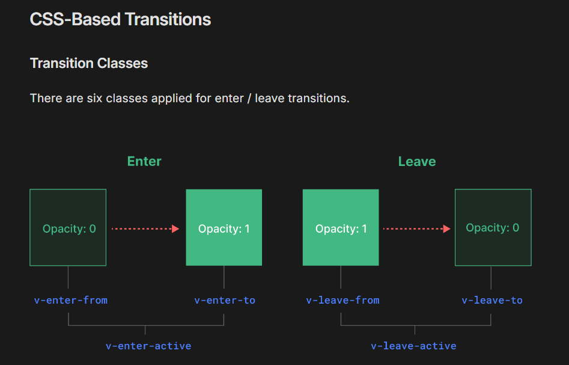
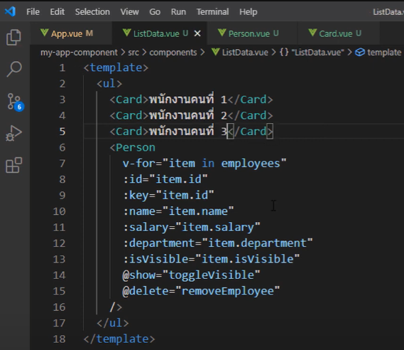
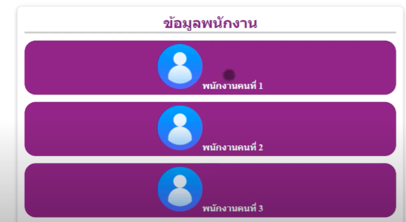
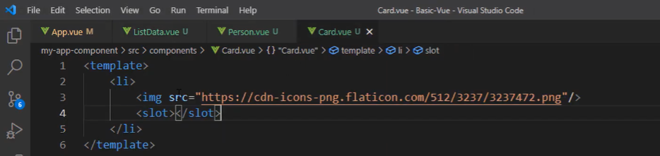
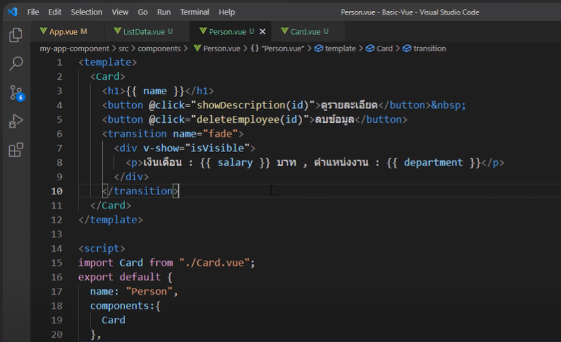
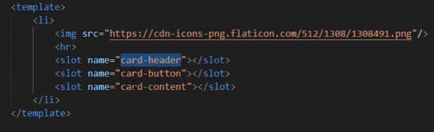
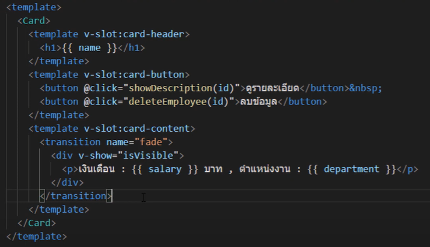

# GIT_Vue
 


## Set up Vue + Tailwind

```npm install -g @vue/cli``` : install Vue CLI

```vue create my-vue-project``` : create Vue project

```npm install vue-router@4``` : install Vue Router

- check version
```vue --version``` => @vue/cli 5.0.8

- Install Tailwind CSS
```
cd vue_weather
npm install -D tailwindcss postcss autoprefixer
```

- Initialize Tailwind CSS
```npx tailwindcss init -p```

- Configure Tailwind , in the tailwind.config.js file
```
/** @type {import('tailwindcss').Config} */
module.exports = {
  content: [
    "./index.html",
    "./src/**/*.{vue,js,ts,jsx,tsx}",
  ],
  theme: {
    extend: {},
  },
  plugins: [],
}
```

- Include Tailwind in Your CSS , Create a CSS file name "tailwind.css" in src/assets/tailwind.css
```
@tailwind base;
@tailwind components;
@tailwind utilities;
```

- In your main.js file, import the Tailwind CSS file you just created:
```import './assets/tailwind.css'```


## Dependency
```
npm install uuid
npm install axios
npm install dotenv


```


## How to run FrontEnd
```
cd .\vue_weather\
npm run serve
```

## Tech Stack :
- bootstrap , tailwind , Vue


- trick create component
```<>```

<details>
<summary><h2>Function</h2></summary>


- แสดงสภาพอากาศปัจจุบัน: แสดงอุณหภูมิ, ความชื้น, ความเร็วลม, และสภาพอากาศปัจจุบัน (เช่น แดด, ฝน, เมฆ)
- หาตำแหน่งปัจจุบัน
- ค้นหาสภาพอากาศตามตำแหน่งที่ตั้ง
- เลือกหน่วยอุณหภูมิ: ผู้ใช้สามารถเลือกหน่วยอุณหภูมิเป็นเซลเซียส (°C) หรือฟาเรนไฮต์ (°F)
- แสดงสภาพอากาศตามตำแหน่งปัจจุบัน: ใช้ Geolocation API เพื่อดึงสภาพอากาศปัจจุบันตามตำแหน่งที่ตั้งของผู้ใช้
- แสดงข้อมูลสภาพอากาศตามเวลา: แสดงสภาพอากาศรายชั่วโมงสำหรับวันปัจจุบัน
- 
- คำนวณค่าดัชนี UV , แสดงกราฟอุณหภูมิ , แสดงคุณภาพอากาศ
</details>


<details>
<summary><h2>Basic Vue</h2></summary>

- วิธีผูก attribute เข้ากับ data ใช้ v-bind โดยย่อด้วยการใส่แค่ colon(:)
```JS

<a :href="social">Social</a>
data(){
    return{
        picture:"https://encrypted-tbn0.gstatic.com/images?q",
        width:120,
        social:https://www.google.com
    }}
```

- V-if , V-show , Computed , Watchers
v-if: Create or completely remove elements from the DOM.
v-show: Just hide or show elements using CSS (display: none)
```JS
<p> {{ animals[0] }} and {{ general.gender }} </p>
// V-if
<p v-if="animals.length === 0">There are no animals at all.</p>
<div v-else>
    {/* Array */}
    <ul>
        <li v-for="(animal, index) in animals" :key="index">{{ animal }}</li>
    </ul>
    {/* Object */}
    <ul>
        <li v-for="(item, key) in general" :key="key"> {{ key }} - {{ item }} </li>
    </ul>

    {/* Onclick */}
    <button @click="toggleVisible">{{ isVisible ? "hide" : "show" }} detail</button>
    {/* V-show */}
    <p v-show="isVisible">Detail 🧐</p>
</div>

{/* Computed */}
<h1>Computed : {{ getIncome }} </h1>
<h1>Computed : {{ getDepartMent }} </h1> 

    data(){
        return{
            animals:["dog", "cat", "panda"],
            general:{gender"girl" , age:"12", status:false},
            isVisible:false,
            salary:1000
        }},
    methods:{
        toggleVisible(){
            this.isVisible = !this.isVisible;
    }},
    computed:{ // watcher = track change , computed = store the result of change  
        getIncome() {
            return ${this.salary} * 12;
        },
        getDepartMent(){
            return this.salary >= 30000 ? "Wow" : "Fight"; // It is not recommended to insert this condition into a template. Most will be put in computed.
            // Templates are not popular for writing logic.
        }
    },
    watch:{
        salary(value){
            if(value > 50000){
                alert("yay u did it");
                setTimeout(()=>{
                    this.salary = 20000
                },2000) // delay 2 seconds to reset salary.
            }
        }
    },
    
    
```

- Pattern
```JS
<template>
  <section>
    <h1>Hello world</h1>
    <h1>{{ text }}</h1>
    <h1>{{ getText() }}</h1>
  </section>
</template>
<script>
export default {
  name: 'App',
  data(){
    return{
      text:"hello world",
    }
  },
  methods:{
    getText(){
      return this.text + "!!!"
    }
  }
}
</script>
<style></style>
```


- Form & Ref 
```JS
<form @submit="submitForm">
    <label>ป้อนชื่อเล่น : </label>
    <input type="text" v-on:input="setNickName" ref="nicknameEl" />
    <button type="submit">บันทึก</button>
</form>
methods:{
    submit(e){
        e.preventDefault(); // => Prevent reset of form fields , But it can be shortened by deleting this line and adding it directly to the form 
        // <form @submit.prevent="submitForm">
        alert("Hello")
        this.nickname = this.$refs.nicknameEl.value;
    },
    setNickName(event){
        console.log(event.target.value);
    }
}
```


- Event Modifier : Check what type of event it is ex. right-click, left-click, or press a key.
```JS
<button @click.right="increment">Right mouse click</button>
<button @click.middle="increment">Click the mouse in the middle.</button>
<button @click.ctrl="increment">Click Ctrl together with left mouse click.</button>
```


- Style scope : If u don't want to use style together in every component. maybe u use style together(not use scope) in App.vue
```JS
<style scoped></style>

```

- Transition : https://vuejs.org/guide/built-ins/transition
```JS
<transition name="fade" >
</transition>
<style>
    .fade-enter-from{
        opacity:0;
    }
    .fade-enter-active{
        transition: all 0.5s linear;
    }
</style>

```


</details>


<details>
<summary><h2>Component</h2></summary>

- import and use component
```JS
<template>
    <ListData />
</template>
<script>  
import ListData from "./componenst/HelloWorld.vue";
export default {
  name: 'App',
  components:{
    ListData // import component
  }
}
</script> 
```

- tranfer data 
```JS
Parent : <Person animal="cat" />
Children :
<script>
    export default {
        name: "Person",
        data(){ return { }},
        props:["animal"] // Can be used in template as this --> <h1> {{ animal }} </h1>
    }
</script>
```

- Dynamic props
```JS
Parent : 
<ListData :employees="employeesWantToTranfer" />  // want to tranfer data but it must write "", so there must be bind (:) in front of the props
<script>
    export default {
        name: "Person",
        data(){ return {
            employeesWantToTranfer:[
                {name:"name", salaray:2000}
            ]
        }},
    }
</script>
// => in ListData
<template>
    <Person 
        v-for="(item, index) in employees"
        :key="index"
        :name="item.name"
        :salary="item.salary"
    />
</template>
props:["employees"] 
```


- Props validation
```JS
<script>
    export default {
        name: "Person",
        data(){ return { }},
        props:{
            name:{
                type:String,
                required:true,
            },
            salary:{
                type:Number,
                default:0 // If there is no salary , set the default value as zero
            }
        } 
    }
</script>
```

- Custom Event : Send information from Children to Parent. Children can't talk each other so it must to send event to Parent
```JS
<button @click="showDescription(id)">see Detail</button>
methods:{
    showDescription(id){
        this.$emit("show", id); // send event name show to Parent , cuz u can name the event therefore being called Custom event 
    }
}

Parent :
<Person @show="doSomething" />
methods:{
    doSomething(id){
        console.log("Child ID : ", id);
    }
}

```

- Slot : Different content will be in slot but image in Card will be same
<div align="center">
    
</div>
<div align="center">
    
    
</div>
1.) use card cover content That will change each data
<div align="center">
    
</div>

2.) slot name
<div align="center">
    
    
</div>

- V-Model Form
```JS
<form>
    <div class="form-control">
        <label for="emp-name"> name </label>
        <input type="text" v-model.trim="employee.name" />
        {/* v-model.trim = Its function is to cut out whitespace that is in front and behind the values ​​entered into the input field. */}
    </div>
    {{JSON.stringify(employee)}}  {/* this line is for debugging to view employee in data */}
</form>

data(){
    return{
        employee:{
            name:"cat",
        }
    }
}

```


</details>


---


## Extensions in VSCode
- vetur
- ESLint
- Vue VSCode Snippets
- Tailwind CSS IntelliSense


## Ref

- https://cdnjs.com/libraries/font-awesome
- https://openweathermap.org/api/one-call-3#current (weather api)
- https://home.openweathermap.org/
- https://tailwindcss.com/


- Geolocation API
- OpenWeatherMap API